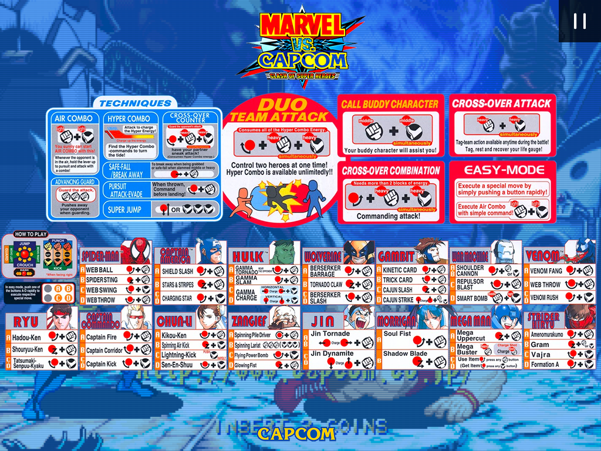

# Arcade pause overlays for Retroarch

This repo contains images of arcade games coming from marquees, cards, etc., restored and re-arranged for use as pause overlays in Retroarch cores.
These overlays will usually contain instructions for the game in question, such as movements list for fighting games, rules for puzzle games, etc.



If Retroarch is properly set-up, a pause overlay will show up when emulation is paused.

## Installing in Retropie

* Download the images and put them in `/opt/retropie/emulators/retroarch/overlays/pause`. Note that you'll always need to copy `empty.png`, no matter what.
* In `retroarch.cfg`, look for `input_overlay_next` and `input_pause_toggle` configurations and put the same key/button value for both.
* Create a custom configuration in your `roms` folder for each game you want to add a pause overlay. Name it `<romname.zip>.cfg` with the following content:

```
input_overlay = "/opt/retropie/emulators/retroarch/overlays/pause/<romname>.cfg"
input_overlay_enable = "true"
input_overlay_opacity = "1.000000"
```

* Create an overlay configuration in `/opt/retropie/emulators/retroarch/overlays/pause/<romname>.cfg` for each game you want to add a pause overlay with the following content:

```
overlays = 2
overlay0_overlay = "empty.png"
overlay0_name = "pause"
overlay0_descs = 0

overlay1_overlay = "<overlay file>"
overlay1_rect = "0.0,0.0,1.0,1.0"
overlay1_full_screen = true
overlay1_descs = 1
overlay1_desc0 = "overlay_next,1,1,rect,1,1"
overlay1_desc0_next_target = "pause"
```

## Contributing

So you want to contribute more images? Great! Just make a pull request, taking into account the following when creating your images:

* Image apect ratio must match intended host's aspect ratio. Currently we include overlays for 4:3 displays only, but will accept overlays for other aspect ratios as well.
* Use original artwork from actual arcade machines. Disposition changes are allowed to adapt them to the intended display aspect ratio.
* Use transparencies in background whenever possible, so they blend nicely with the running game when paused. Take a look at how existing overlays use it.
* Image file name should be equal as MAME rom name.

## Acknowledgments

[chipsnblip](https://retropie.org.uk/forum/user/chipsnblip) and [johnodon](https://retropie.org.uk/forum/user/johnodon) from the Retropie forums for the original idea.
